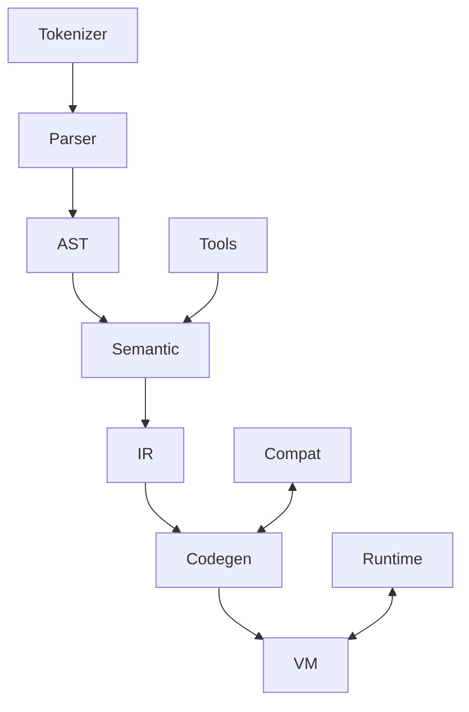

# gdscript2 模块总体计划

## 目标与范围

- 在 `modules/gdscript2` 重写 GDScript，保持 ~99% 兼容常用语法/运行时/内置函数，支持现有项目迁移。
- 采用现代分层架构（前端-中端-后端解耦），提升可维护性与可测试性，优化增量编译与工具链集成。
- C++17 约束，尽量不引入额外第三方依赖，重用 Godot 基础设施（Variant、HashMap、线程、内存分配器）。

## 目标架构

- 目录建议（新建于 `modules/gdscript2/`）：
- `front/`：词法、语法解析、AST（保持与现有 token/AST 结构兼容度高，提供适配层）。
- `semantic/`：符号表、类型推断、数据流/控制流分析，提供 SSA/CFG 表示以便优化与 lsp 诊断。
- `ir/`：中间表示（高层 IR + 可选低层 IR），支持 passes（常量折叠、死代码消除、inlining）。
- `codegen/`：字节码/可执行构建器，与 VM 接口解耦；可插拔后端（现有字节码 vX + 未来备用格式）。
- `vm/`：执行引擎，指令表、调度、内建调用、垃圾回收接口；支持调试 hook。
- `runtime/`：运行时桥接 Godot 对象/Variant/内建函数注册。
- `tools/`：语言服务器、补全、符号索引、着色与诊断，尽量从 `semantic/` 复用信息。
- `compat/`：向后兼容层（旧 API 适配、错误码/警告映射、字节码版本转换器）。
- `tests/`：单测与集成测试（语法、语义、IR、VM、LSP、回归用例）。

### 模块交互（示意）

## 兼容性策略

- 保留：现有语法、内建类型/函数、信号、export/hints、协程/yield/await、typed/untyped 混用、单元/集成测试期望行为。
- 改进但保持行为：错误信息更精确（位置、类型），警告分类可配置；类型推断更强但默认不破坏动态行为；调试事件更稳定。
- 允许的 break（需文档+开关）：
- 底层字节码版本升级（提供转换器 + `compat` 开关）。
- 弃用少用的调试/编辑器私有接口，提供 shim 并标记 deprecated。
- 更严格的未使用变量/不可达代码警告，默认 warning 可配置为 off。
- 内部 API 重命名（仅模块内），对外脚本 API 不破坏。

## 开发里程碑

- M0 基线：创建 `modules/gdscript2` 框架目录，复制/拆分必要的注册与 CMake/SCsub 配置，stub 关键子模块接口。
- M1 前端：重用 tokenizer 规则，构建模块化 Parser+AST；建立 golden 语法用例集。
- M2 语义：实现符号表/作用域、类型推断、控制/数据流图；输出诊断接口给 tools。
- M3 IR 与 passes：定义高层 IR，完成基础优化（const fold、dce、inlining stub）。
- M4 Codegen：生成兼容字节码 vX；建立 bytecode 版本适配层。
- M5 VM：指令调度、内置调用桥接、调试 hook；性能基准与回归对比。
- M6 Tools：LSP/补全/跳转/诊断复用 semantic；着色与符号索引。
- M7 兼容与迁移：旧字节码转换、警告映射、开关/标志文档。
- M8 稳定化：性能回归、内存与并发测试，API freeze 与文档。

## 测试与质量

- 单元测试：front（词法/语法）、semantic（推断/诊断）、IR passes、codegen、VM 指令正确性。
- 集成测试：脚本运行对比 `modules/gdscript` 行为（golden 脚本集）、LSP 功能测试、调试接口测试。
- 兼容回归：旧项目脚本集/示例运行比对、字节码加载/转换测试。
- 基准：热点指令/函数调用/协程/信号/内建容器操作；与现有模块对比性能。
- 工具链：静态检查（clang-tidy 可选）、编译旗标保持与主仓一致，CI 复用现有 pipeline。

## 交付物

- `modules/gdscript2/` 目录结构与 SCsub/CMake glue。
- 架构文档与迁移指南（兼容开关、弃用列表、字节码版本策略）。
